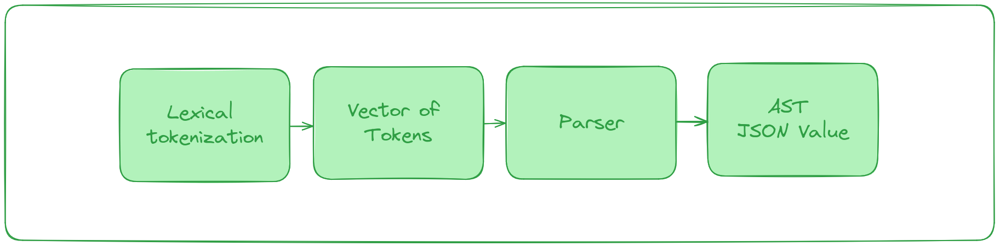

# jsruston - Json Parser
Simple and lightweight json parser implemented in rust. `Jsruston = Json + rust`


### Usage
```rust
fn main() -> Result<(), Box<dyn Error>> {
    let john = r#"{
         "key": "value",
        "key-n": 101,
        "key-o": {},
        "key-l": []
    }"#;
    let parserd_json = Parser::parse_json(john)?;
    let key = &parserd_json["key-o"];
    println!("parsed json value: {:?}", key);
    Ok(())
}

```
### JsonValue Implementations
parse_json and parse returns the type JsonValue which has implementation as below
```rust 
fn get(&self, key: &str) -> Result<&JsonValue, ParsedJsonError>
fn get_string(&self) -> Result<&str, ParsedJsonError>
fn get_number(&self) -> Result<f64, ParsedJsonError>
fn get_boolean(&self) -> Result<bool, ParsedJsonError>
fn is_null(&self) -> bool
fn get_from_object(&self, key: &str) -> Result<&JsonValue, ParsedJsonError>
fn len(&self) -> Result<usize, ParsedJsonError>
fn index(&self, index: usize) -> Result<&JsonValue, ParsedJsonError>
```

### Todo

- [ ] Serialization and Deserialization
- [ ] Redefine number type in JsonValue (currently directly converts to f64)
- [ ] Robus error handling (currently panics overloding indexing with [] for errors)
- [ ] Prettify output
- [ ] Add more test cases


### Resources
- [RFC8259](https://datatracker.ietf.org/doc/html/rfc8259)
- [Astexplorer](https://astexplorer.net/)

